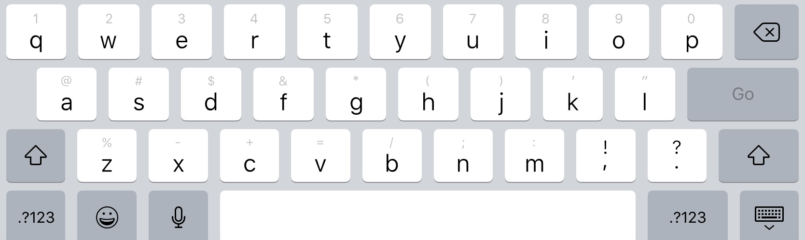
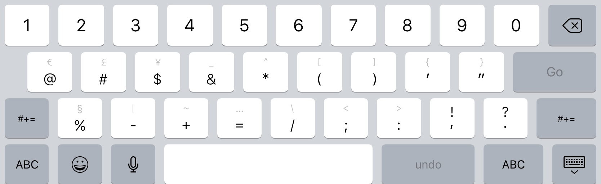
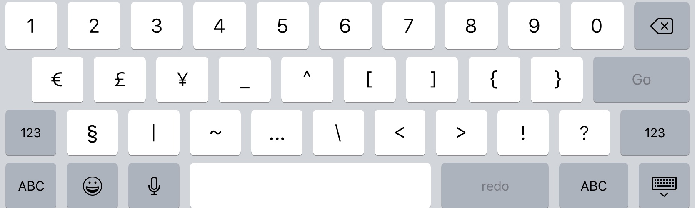

Today, I discovered a bug in the Apple iOS keyboard. First, when you open the keyboard, it looks like this:

I wanted to type a hashtag, so I pressed the number keyboard button:

Then I tapped the symbol keyboard button to get to hashtag:

But the hashtag isn't there! It is in the number keyboard. And the hashtag is even on the symbol keyboard icon! If anyone knows how to report this, please do.
